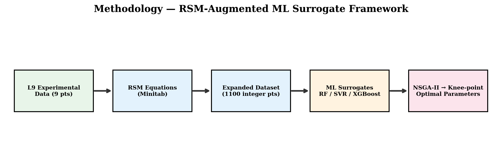

# Data-Driven Surrogate Modelling and Multi-Objective Optimization of WEDM Parameters for Ti-6Al-4V Alloy

**BTP-II Report**

**Author:** Sagar Chandan

---

## Overview

This repository contains the code, data, and reports for a two-phase BTP 
investigating data-driven surrogate modelling and multi-objective optimization 
of Wire EDM (WEDM) machining parameters for titanium alloys.

### What this project does

1. **RSM-based data expansion:** Takes a 9-point Taguchi L9 experimental dataset and expands it to ~1,100 points using Response Surface Methodology equations
2. **ML surrogate training:** Trains Random Forest, SVR, and XGBoost models as surrogates for Material Removal Rate (MRR) and Surface Roughness (SR)
3. **Multi-objective optimization:** Uses NSGA-II with each surrogate to produce Pareto-optimal trade-off solutions
4. **Knee-point analysis:** Identifies the balanced compromise parameter set from the Pareto front
5. **Experimental validation:** Validates the predicted optimum on a physical WEDM machine at IIT Kharagpur

### Key Results

| Metric | SVR (Best) | RF | XGBoost |
|--------|-----------|-----|---------|
| CV R² (MRR) | 0.9997 | 0.9737 | 0.9917 |
| CV R² (SR) | 0.9997 | 0.9924 | 0.9942 |
| Hypervolume | 1.014 | 0.987 | 1.004 |

**Recommended Parameters (Knee-point):** Ip = 20 A, Ton = 110 µs, Toff = 60 µs, Vs = 233 V

**Experimental Validation:**
- MRR: 7.50 mm³/min (predicted 7.98, error 6.0%)
- SR: 1.74 µm (predicted 1.97, error 11.7%)

## Methodology

```
L9 Data (9 pts) → RSM Equations → Expanded Dataset (1,100 pts) → ML Surrogates → NSGA-II → Knee-point → Experimental Validation
```



## Dataset

The primary experimental data is sourced from:

> Jagdale, S. N. et al. (2025). "Experimental investigation of process parameters in Wire-EDM of Ti-6Al-4V." *Scientific Reports*, 15, 5652.

| Parameter | Low | Mid | High | Unit |
|-----------|-----|-----|------|------|
| Peak Current (Ip) | 20 | 25 | 30 | A |
| Pulse-on Time (Ton) | 110 | 115 | 120 | µs |
| Pulse-off Time (Toff) | 50 | 55 | 60 | µs |
| Servo Voltage (Vs) | 220 | 230 | 240 | V |

## Experimental Setup

Validation experiments were conducted on an **Electronica Job Master D-zire** CNC Wire EDM machine (Electronica HiTech Machine Tools Pvt. Ltd., SRP Electronica Group). Surface roughness was measured using a **Taylor Hobson Talysurf** profilometer with TalyMap Gold 7.1 software.

## Dependencies

```
numpy
pandas
scikit-learn
xgboost
matplotlib
pymoo
joblib
```

## Related Work

- **BTP-I:** Data-Driven Modeling and Optimization of WEDM Parameters for Ti-6Al-7Nb (Nov 2025)

## License

This project is licensed under the MIT License. See [LICENSE](LICENSE) for details.
